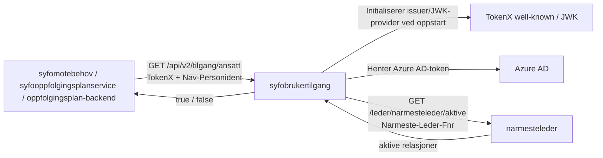

# API for tilgang til ansatte i sykefraværsoppfølgingen

[](https://github.com/navikt/syfobrukertilgang/actions/workflows/build-and-deploy.yaml)
[](https://kotlinlang.org/)
[](https://ktor.io/)
[](https://gradle.org/)
[](https://kotest.io/)

> **Merk:** Tjenesten er kun for internt bruk av eksisterende konsumenter. Nye tjenester skal ikke integrere seg mot den.

## Formål

Backend-API tjeneste som avgjør om en innlogget bruker har tilgang til en ansatt i sykefraværsoppfølgingen.

- mottar forespørsler på vegne av en innlogget bruker
- leser personident fra token og ansattens personident fra request-header
- henter aktive relasjoner fra `narmesteleder`
- svarer med `true` eller `false`

## API

**GET** `/api/v2/tilgang/ansatt`

## Arkitektur



## Utvikling (kjøre lokalt)

### Forutsetninger

- Java 21
- tilgang til nødvendige lokale verdier for TokenX, Azure AD og `narmesteleder`

### Lokal kjøring

1. Opprett `src/main/resources/localEnv.json` med utgangspunkt i `src/main/resources/localEnvForTests.json`.
2. Erstatt testverdiene med reelle verdier for:
   - `narmestelederScope`
   - `narmestelederUrl`
   - `aadClientId`
   - `aadClientSecret`
   - `aadTokenEndpoint`
   - `syfobrukertilgangTokenXClientId`
   - `tokenXWellKnownUrl`
3. Bygg kjørbar jar:

   ```bash
   ./gradlew shadowJar
   ```

4. Start appen:

   ```bash
   java -jar build/libs/syfobrukertilgang-1.0-SNAPSHOT-all.jar
   ```

Applikasjonen bruker `application.conf` med `ktor.environment=dev` lokalt. Port settes fra `localEnv.json`.

### Nyttige kommandoer

```bash
./gradlew shadowJar
./gradlew test
./gradlew detekt
```

`./gradlew build` kjører build, tester og statisk analyse samlet.

## For Nav-ansatte

Interne henvendelser kan sendes via Slack i kanalen [#esyfo](https://nav-it.slack.com/archives/C012X796B4L).
