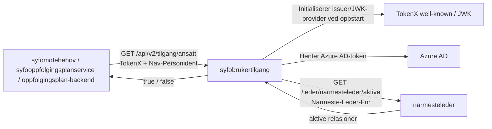

# API for tilgang til ansatte i sykefraværsoppfølgingen

[](https://github.com/navikt/syfobrukertilgang/actions/workflows/build-and-deploy.yaml)

## Miljøer

- 🚀 [Produksjon](https://syfobrukertilgang.intern.nav.no)
- 🛠️ [Utvikling](https://syfobrukertilgang.intern.dev.nav.no)

## Formål

`syfobrukertilgang` er et backend-API som avgjør om en innlogget bruker har tilgang til en ansatt i sykefraværsoppfølgingen.

Tjenesten:

- mottar forespørsler på vegne av en innlogget bruker
- leser personident fra token og ansattens personident fra request-header
- henter aktive relasjoner fra `narmesteleder`
- svarer med `true` eller `false`

## API

### Beskyttet API

**GET** `/api/v2/tilgang/ansatt`

Header:

- `Authorization: Bearer <token>`
- `Nav-Personident: <11 siffer>`

Respons:

- `200 OK` med `true` eller `false`
  - `true` betyr at tilgang ble bekreftet
  - `false` betyr enten at brukeren ikke har en aktiv relasjon til ansatt, eller at oppslaget mot `narmesteleder` feilet
- `400 Bad Request` hvis `Nav-Personident` mangler eller er ugyldig
- `401 Unauthorized` hvis token mangler, ikke er gyldig, eller ikke inneholder `pid`

Operasjonelt kan disse to `false`-utfallene skilles ved å følge Prometheus-metrikkene `syfobrukertilgang_call_narmesteleder_success_count` og `syfobrukertilgang_call_narmesteleder_fail_count` på `/prometheus`.

## Arkitektur



Ved oppstart leses TokenX sitt well-known-endepunkt for å hente issuer og `jwks_uri`. Selve JWK-oppslagene håndteres deretter av JWK-provider/cache, ikke som et eksplisitt well-known-oppslag per request i applikasjonskoden.

## Kom i gang

### Forutsetninger

- Java 21
- tilgang til nødvendige lokale verdier for TokenX, Azure AD og `narmesteleder`

### Lokal kjøring

1. Opprett `src/main/resources/localEnv.json` med utgangspunkt i `src/main/resources/localEnvForTests.json`.
2. Erstatt testverdiene med reelle verdier for:
   - `narmestelederScope`
   - `narmestelederUrl`
   - `aadClientId`
   - `aadClientSecret`
   - `aadTokenEndpoint`
   - `syfobrukertilgangTokenXClientId`
   - `tokenXWellKnownUrl`
3. Bygg kjørbar jar:

   ```bash
   ./gradlew shadowJar
   ```

4. Start appen:

   ```bash
   java -jar build/libs/syfobrukertilgang-1.0-SNAPSHOT-all.jar
   ```

Applikasjonen bruker `application.conf` med `ktor.environment=dev` lokalt. Port settes fra `localEnv.json`.

### Nyttige kommandoer

```bash
./gradlew shadowJar
./gradlew test
./gradlew detekt
```

`./gradlew build` kjører build, tester og statisk analyse samlet.

## Team og kontakt

- Team: `team-esyfo`
- CODEOWNERS: `@navikt/team-esyfo`
